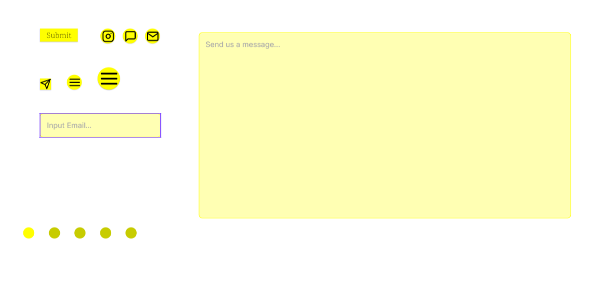
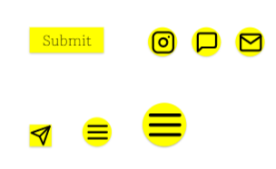
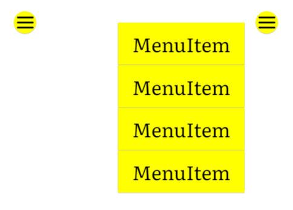

Buttons are a central component of our system. Buttons allow the user to interact and pass information purposefully to our company.

---

We have a number of types of buttons. Below is a button overview:

<BrandBox>

</BrandBox>

All of the buttons follow the yellow theme. We use dark ink black for the inner icons. 
We also keep the shapes rounded to be in line with the learning molecule. 

<BrandBox>

</BrandBox>

We have a top menu button/hamburger that opens into a menu/drop-down list of items. 

<BrandBox>

</BrandBox>

