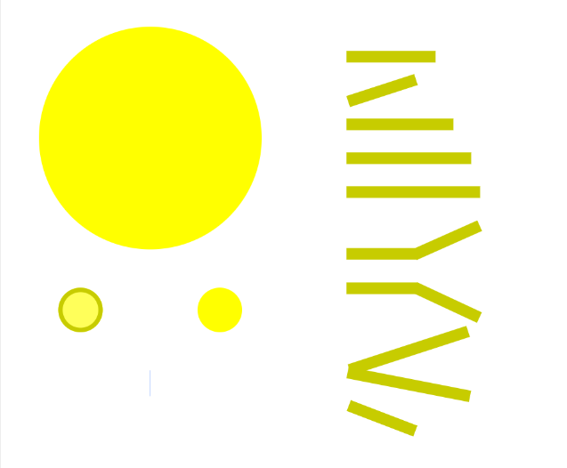
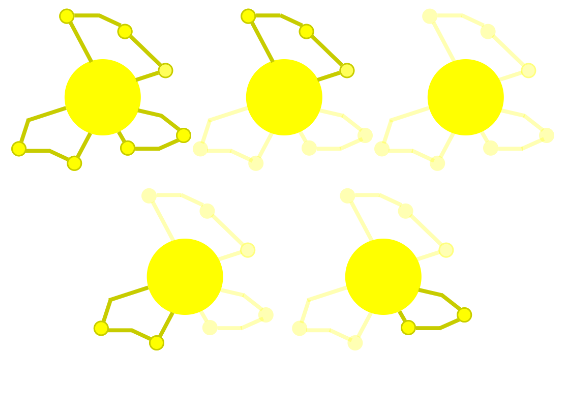
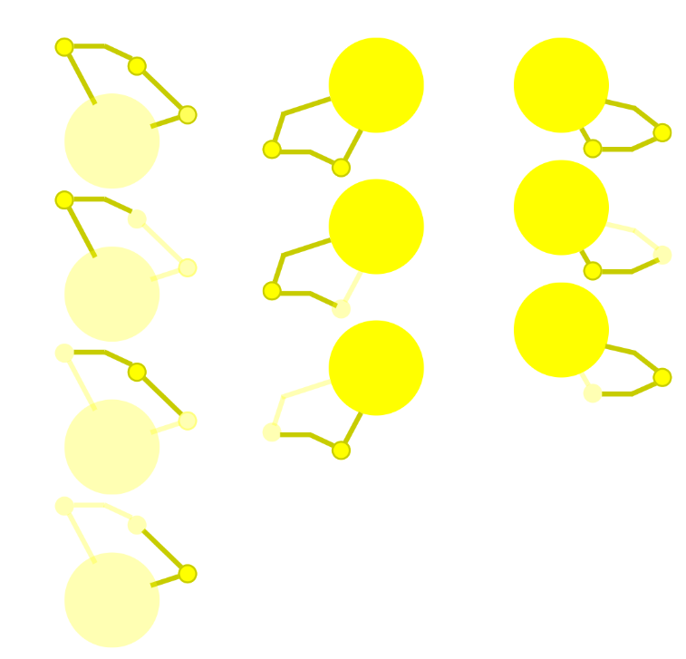
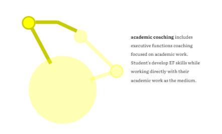
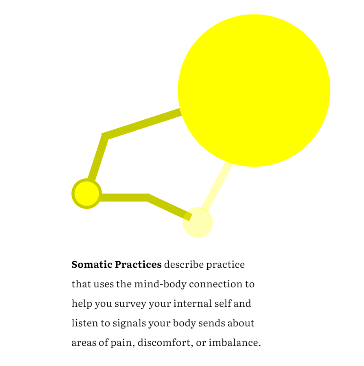
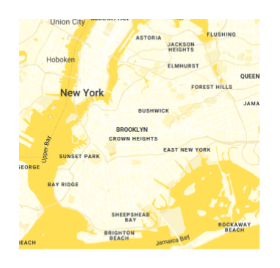

The signature element of the brand, a large part of communication is done through a series of colourful, visualizations. 
We center these illustrations on the idea of a ```Learning Molecule```. The first thing to consider are the basic building 
blocks of the molecule. Using ```atomic design ideas``` we construct the building blocks of the visualization.



## Objects

There are many iterations of this molecule, however, they are all deconstructions of the 'full' version which is represented as the first item in the list below:
 These are the base individual elements of the illustrative universe. These can be used by themselves or as constructors for the compositions and platforms. 
These have been inspired by the work [thebodyliterate.com](thebodyliterate.com). 



We can continually deconstruct these molecules more:




---

## Compositions

Using the objects, you can create variety of compositions to communicate an idea. Note: we are limiting the amount
of permutations to use in our design. To us, this represents a fundamental idea of our work. Creativity comes with limitations.
Our aim as supporters of learners inside of the education system, is that we are bounded by the limits of the curriculums we support,
however, our creativity is limitless.

<Grid gap={2} columns={2}>
<BrandBox>


</BrandBox>
<BrandBox>


</BrandBox>
>
</Grid>

<br />

<BrandRule> <strong>Inventive & Experiential </strong>

bodyLITERATE is a place for endless creativity and holistic care. We want to offer an alternative to the education system for neuro-diverse learners.
Because of this, we ask, how do we offer visitors to our products a learning experience that's different than the normal education consultation site? 
We want our visitors to experience our teaching through the viewing of these information.
Are there alternative ways we might convey an idea so that visitors experience our style of teaching by just visiting us online?

</BrandRule>
<BrandRule> <strong>Just a few </strong>

Try to keep to a maximum of 3 major elements. Again, we are limited by systems, but endless in creativity.
</BrandRule>
<BrandRule> <strong>Consistency with proportions </strong>

Maintain a consistent size of items. For example, if an item represents a meta idea, it should be larger than a sub-idea. We need to keep language consistent so that people can 'read' the visualizations.
</BrandRule>
<BrandRule> <strong>Maintain Color Contrasts </strong>

Avoid all your elements being of the same colour or same color tone. We ensure that items maintain enough contrast using our basic color pallete.
</BrandRule>
<BrandRule> <strong>Outlines are thin, and all the same weight  </strong>

Use outlines to showcase sections and components. This works like reading chapters in a novel. We maintain outlines to show users we have gone to a different section.
</BrandRule>
<BrandRule> <strong>Concentrated, but not overlapping </strong>

Objects should gather around a central point, but avoid overlap. This ensures more clarity and space for people to visually process the information.
</BrandRule>

---

## Other Images

Additional images can be used that reflect more realworld photos. However, we maintain the yellow theme. 
We also will resize images that do not allow the yellow theme as we want to minimize
their weight in the overall site.

<Grid gap={2} columns={2}>
<BrandBox>


</BrandBox>
<BrandBox>


</BrandBox>
</Grid>

<br />
A  few additional tips for compositions:

<BrandRule> <strong>Just a few </strong>

Try to keep to a maximum of 3 major elements. Small element additions beyond this can be fun, but further than that, it gets crowded. 
</BrandRule>
<BrandRule do={false}> <strong> Avoid overlap or images that are too close. Aim for atleast a padding of 5 </strong>

Use a 'Z' pattern for image placement whenever possible
</BrandRule>
<BrandRule> <strong>Use a consistent theme </strong>

We want users to have a unified experience across our products
</BrandRule>
