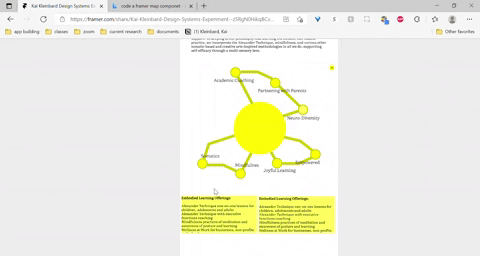
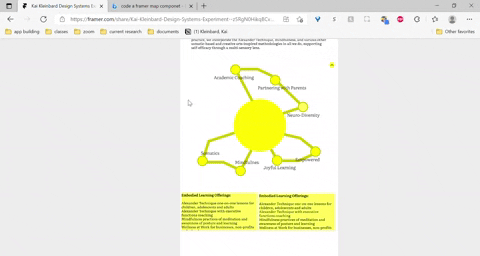
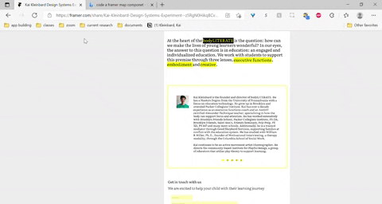

ACCORDING THE MATERIAL DESIGN THE AIM OF MOTION ON A SITE IS TO:

Informative: Motion design informs users by highlighting relationships between elements, action availability, and action outcomes.

Expressive: Motion celebrates moments in user journeys, adds character to common interactions, and can express a brand’s style.

---

Vertical scroll allows the user to use physical motion to move through specific portions of the page.

<BrandBox>

</BrandBox>

Notice a 'bounce' effect to mimic real life stopping at the end of a scroll.

<BrandBox>

</BrandBox>

Side ways scrolling is excellent for profiles or information blocks

<BrandBox>

</BrandBox>

